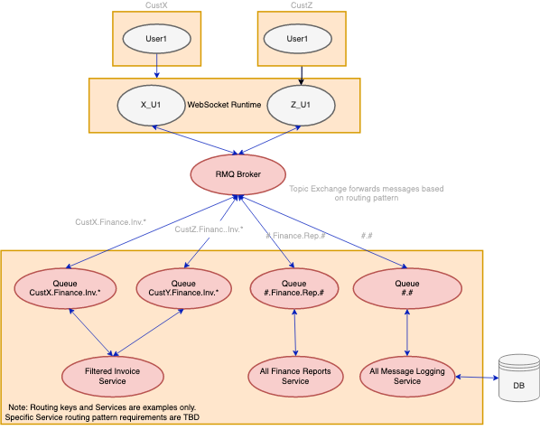

# ENFOS Pub Sub Workflow POC Spring Boot and RabbitMQ

This application implements an Event mechanism usable in Microservice environments.

## Companion Wiki Page
The companion ENFOS Wiki article to this project can be found [here](https://wiki.enfos.com/en/backend/rabbitmq-messaging).

## Scenario

* a publisher publishes events with one of these topics
  *  "custX.finance.report",
  *  "custX.finance.invoice",
  *  "custX.aoc.survey",
  *  "custX.aoc.sample",
  *  "custZ.finance.report",
  *  "custZ.finance.invoice",
  *  "custZ.aoc.survey",
  *  "custZ.aoc.sample",
  *  "custZ.user.deleted"
* a subscriber subscribes to events of a specific topic from
  a queue specific to its (micro-)service

## Usage

1. [Install RabbitMQ](https://www.rabbitmq.com/download.html) (if it's installed on another
host than localhost then you need to change the connection properties in `application.properties`)
1. start a couple instances of the demo application in `subscriber` mode, for example:
   * `./gradlew bootrun -Dspring.profiles.active=subscriber -Dsubscriber.exchange=enfos.test.topic -Dsubscriber.queue=custZService -Dsubscriber.routingKey=custZ.*`
   * `./gradlew bootrun -Dspring.profiles.active=subscriber -Dsubscriber.exchange=enfos.test.topic -Dsubscriber.queue=custYService -Dsubscriber.routingKey=custY.*`
1. start a single instance of the demo application in `publisher` mode:
   * `./gradlew bootrun -Dspring.profiles.active=publisher -Dpublisher.exchange=enfos.test.topic`
1. check the log output of the publisher and the subscribers to see which events are produced and which events
   are consumed by each subscriber
